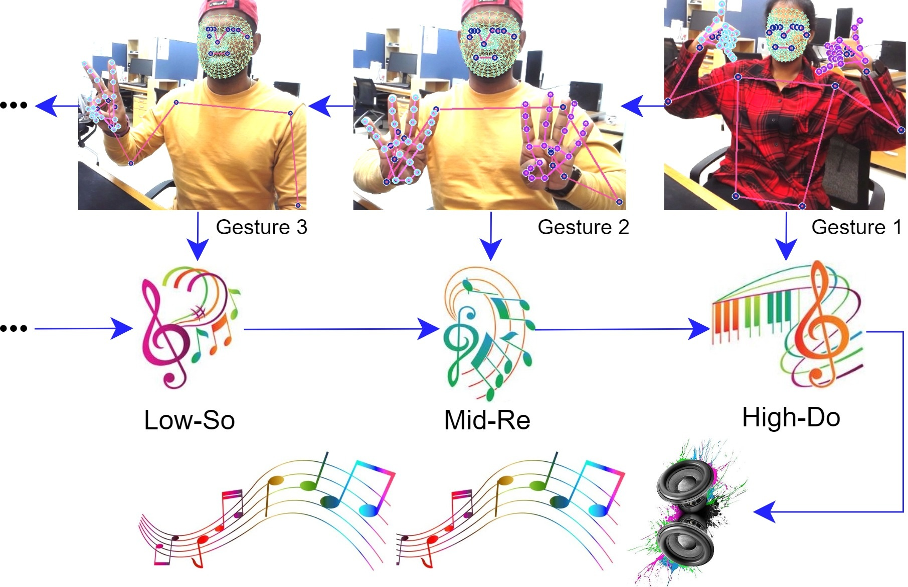
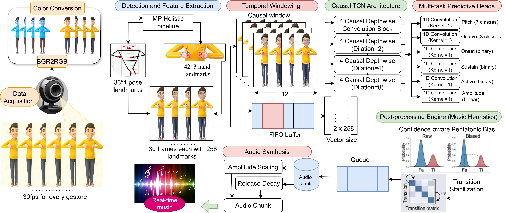
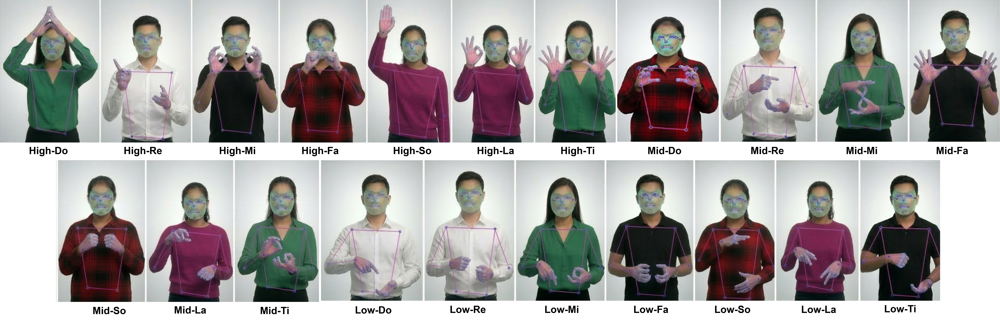

# 🎵 Gesture2Music — Real-Time Gesture-Driven Music Generation

> A low-latency streaming framework for continuous music generation from live webcam gestures using a causal Temporal Convolutional Network (TCN).

[](https://cvpr.thecvf.com/)
[]()
[](https://www.python.org/)
[](https://pytorch.org/)
[](https://mediapipe.dev/)
[]()
[]()

---

> 📄 **Published at:** First International Workshop on Interactive Physical AI (IPA), IEEE/CVF Conference on Computer Vision and Pattern Recognition (**CVPR 2026**)  
> 🔗 **Paper:** `[Link coming soon]`
---

## Table of Contents

- [Overview](#overview)
- [Keywords](#keywords)
- [Proposed Framework](#proposed-framework)
- [Dataset](#dataset)
  - [Gesture-Note Classes](#gesture-note-classes)
  - [Data Collection Protocol](#data-collection-protocol)
  - [Synthetic Stream Generation](#synthetic-stream-generation)
  - [Note Frequency Map](#note-frequency-map)
- [Sample Outputs](#sample-outputs)
- [Project Structure](#project-structure)
- [Configuration](#configuration)
- [Quick Start](#quick-start)
- [Citation](#citation)

---

## Overview

Gesture-driven music generation is an emerging human-computer interaction paradigm enabling **touch-free and expressive musical interaction**. Existing approaches typically treat the task as isolated gesture classification or map gestures to symbolic outputs (e.g., MIDI) followed by a separate rendering stage — limiting temporal continuity and real-time responsiveness.

**Gesture2Music** addresses these limitations with:

- 🎥 Live webcam input processed via **MediaPipe** landmark extraction
- 🧠 A **causal TCN** for temporally consistent, streaming prediction
- 🎼 **Multi-task prediction heads** for pitch, octave, onset, sustain, amplitude, and activity state
- 🔊 **Real-time audio rendering** with rhythmic quantisation and scale-constrained filtering
- ⚡ **30 ms inference latency** on a standard GPU

<p align="center">
  
  <br/>
  <em>Figure 1: Overview of the Gesture2Music streaming pipeline.</em>
</p>

---

## Keywords

`Gesture Recognition` · `Music Generation` · `Human-Computer Interaction` · `Real-Time Audio` ·
`Temporal Convolutional Network` · `MediaPipe` · `Multi-Task Learning` · `Causal Convolution` ·
`Streaming Inference` · `Body Landmark` · `Note Prediction` · `Touch-Free Interaction` ·
`CVPR 2026` · `Interactive Physical AI`

---

## Proposed Framework

The proposed system follows a **six-stage pipeline**:

| Stage | Component | Description |
|---|---|---|
| 1 | **Video Acquisition** | Frames captured from standard webcam |
| 2 | **Landmark Extraction** | MediaPipe extracts body and hand landmarks per frame |
| 3 | **Temporal Buffering** | FIFO rolling window maintains recent motion history |
| 4 | **Causal TCN Encoder** | Stacked depthwise temporal convolution blocks with increasing dilation — strictly forward-looking |
| 5 | **Multi-Task Prediction** | Separate heads predict pitch, octave, onset, sustain, amplitude, and activity state |
| 6 | **Audio Rendering** | Predicted events rendered using note samples with rhythmic quantisation and scale-constrained filtering |

### Key Design Choices

- **Causal convolutions** — no future-frame access, enabling true real-time deployment
- **Synthetic stream generation** — isolated gesture clips concatenated into pseudo-continuous sequences, with heuristic temporal labels for note boundaries and transitions
- **Temporal consistency loss** — reduces frame-to-frame prediction jitter
- **Spectral proxy loss** — encourages audio-consistent event predictions

<p align="center">
  
  <br/>
  <em>Figure 2: Detailed six-stage pipeline of the Gesture2Music framework.</em>
</p>

---

## Dataset

### Gesture-Note Classes

Because no public dataset exists for gesture-driven music generation, a custom dataset was collected. The dataset covers:

- **7 musical notes:** Do · Re · Mi · Fa · So · La · Ti
- **3 octave levels:** Low · Mid · High
- **21 gesture-note classes** in total (7 × 3)

Each class is associated with a **unique body gesture** recorded under varying lighting, viewpoints, and backgrounds.

### Gesture-Note Class List

```
High-DO   High-Re   High-Mi   High-Fa   High-So   High-La   High-Ti
Mid-Do    Mid-Re    Mid-Mi    Mid-Fa    Mid-So    Mid-La    Mid-Ti
Low-Do    Low-Re    Low-Mi    Low-Fa    Low-So    Low-La    Low-Ti
```

### Data Collection Protocol

| Property | Value |
|---|---|
| Recording device | Webcam at **30 fps** |
| Participants | 5 volunteers |
| Frames per gesture instance | 30 frames |
| Temporal window (inference) | T = 12 frames (causal sliding window) |
| Samples per class per participant | 30 |
| Total samples | 5 × 21 × 30 = **3,150** |

Inter-note pauses are represented by short **neutral segments** with inactive event targets (zero onset, zero sustain, zero amplitude).

Reference audio (`.wav`) for each note class was collected using a sampled digital piano sound bank to build the **audio dictionary** used at render time.

<p align="center">
  
  <br/>
  <em>Figure 3: Data collection setup and synthetic stream construction.</em>
</p>

### Note Frequency Map

| | Do | Re | Mi | Fa | So | La | Ti |
|---|---|---|---|---|---|---|---|
| **Low** | 130.81 Hz | 146.83 Hz | 164.81 Hz | 174.61 Hz | 196.00 Hz | 220.00 Hz | 246.94 Hz |
| **Mid** | 261.63 Hz | 293.66 Hz | 329.63 Hz | 349.23 Hz | 392.00 Hz | 440.00 Hz | 493.88 Hz |
| **High** | 523.25 Hz | 587.33 Hz | 659.25 Hz | 698.46 Hz | 783.99 Hz | 880.00 Hz | 987.77 Hz |

---

## Sample Outputs

Real-time inference frames showing predicted hand gestures, recognised note labels, and the rendered musical output grid.

<p align="center">
  
  <br/>
  <em>Figure 4: Sample inference frames — predicted hand notes (left) and rendered grid notes (right).</em>
</p>

---

## Project Structure

```
Gesture2Music/ 
├── Data/
│   ├── Music_Data/                   ← Gesture video clips (21 classes × 5 participants)
│   │   ├── High-DO/
│   │   ├── Mid-Do/
│   │   ├── Low-Do/
│   │   └── ...                       ← One folder per gesture-note class
│   └── Audio/                        ← Reference .wav files per note class
│       ├── High-DO.wav
│       ├── Mid-Do.wav
│       └── ...  
├── Music2Gesture.py                  ← Training entry point
├── inference.ipynb                   ← Real-time webcam inference 
├── requirements.txt
├── environment.yml
└── README.md
```

---

## Configuration

All paths and hyperparameters are centralised in `config.py`:

### Paths

| Variable | Description |
|---|---|
| `DATA_PATH` | Root folder of gesture video clips |
| `AUDIO_PATH` | Root folder of reference `.wav` audio files |
| `ARTIFACT_DIR` | Base output directory (`./artifacts`) |
| `FIG_DIR` | Training figures and plots |
| `LOG_DIR` | Training logs |
| `AUDIO_OUT_DIR` | Generated audio samples |
| `VIDEO_OUT_DIR` | Inference video recordings |

### Training Hyperparameters

| Parameter | Value | Description |
|---|---|---|
| `STREAM_WINDOW` | `12` | Causal temporal window length (frames) |
| `STREAM_STRIDE` | `1` | Sliding window stride |
| `TRAIN_BATCH_SIZE` | `16` | Batch size |
| `EPOCHS` | `100` | Training epochs |
| `LEARNING_RATE` | `1e-3` | Initial learning rate |

### Audio Parameters

| Parameter | Value | Description |
|---|---|---|
| `SAMPLE_RATE` | `16000` | Audio sample rate (Hz) |
| `CHUNK_DURATION_SEC` | `0.05` | Audio chunk duration per inference step |
| `CHUNK_SAMPLES` | `800` | Samples per chunk (`SR × duration`) |

### Synthetic Stream Parameters

| Parameter | Value | Description |
|---|---|---|
| `MIN_NOTES_PER_STREAM` | `4` | Minimum notes per synthetic stream |
| `MAX_NOTES_PER_STREAM` | `10` | Maximum notes per synthetic stream |
| `PAUSE_FRAMES_RANGE` | `(6, 15)` | Random pause length between notes |
| `TRANSITION_NOISE_STD` | `0.005` | Noise added at note boundaries |

---

## Quick Start

### 1. Install Dependencies 

#### Using pip
```bash
pip install -r requirements.txt
```

#### Using conda
```bash
conda env create -f environment.yml
conda activate src_detection
```
---

### 2. Prepare Data

Use sample_collection.ipynb to collect gesture samples for the corresponding musical note. Organise gesture recordings under `Data/Music_Data/` — one subfolder per gesture-note class:

```
Data/Music_Data/
├── High-DO/    ← video clips for High Do gesture
├── Mid-Do/
├── Low-Do/
└── ...         (21 folders total)

Data/Audio/
├── High-DO.wav
├── Mid-Do.wav
└── ...         (21 .wav files)
```

Audio files and gesture recordings are publicly available on Hugging Face:

| Resource | Link |
|---|---|
| 🔊 Audio Files | [Audio.zip](https://huggingface.co/datasets/Path2AI/Gesture2Music/tree/main/Audio.zip) |
| 🤚 Gesture Data | [Gesture_Data.zip](https://huggingface.co/datasets/Path2AI/Gesture2Music/blob/main/Gesture_Data.zip) |

> 📦 Download and extract both archives into the `Data/` directory before running training or inference.

### 3. Train

Configure Paths and other variables in Gesture2Music.py.

```bash
python Gesture2Music.py
```

Outputs saved to `artifacts/figures/`, `artifacts/logs/`, `artifacts/audio/`.

### 4. Real-Time Inference

```bash
python inference.ipynb
```

Opens webcam feed, extracts landmarks in real time, and renders continuous music based on predicted gesture events. Sample generated video files are provided here.

| Method | Demo |
|---|---|
| 🎵 Discrete mapping music generation | [GRU_Baseline_Demo.mp4](https://huggingface.co/datasets/Path2AI/Gesture2Music/blob/main/GRU_Baseline_Demo.mp4) |
| 🎶 Continuous mapping music generation | [Gesture2Music_TCN_Demo.webm](https://huggingface.co/datasets/Path2AI/Gesture2Music/blob/main/Gesture2Music_TCN_Demo.webm) |

---

## Citation

If you use Gesture2Music in your research, please cite:

```bibtex
@inproceedings{gesture2music2026,
  title     = {Gesture2Music: Low-Latency Streaming Framework for Continuous Gesture-Driven Music Generation},
  booktitle = {Proceedings of the IEEE/CVF Conference on Computer Vision and Pattern Recognition Workshops (CVPRW) — First International Workshop on Interactive Physical AI (IPA)},
  year      = {2026},
  url       = {}
}
```

---

<p align="center">
  Presented at the First International Workshop on Interactive Physical AI (IPA) · CVPR 2026
</p>
